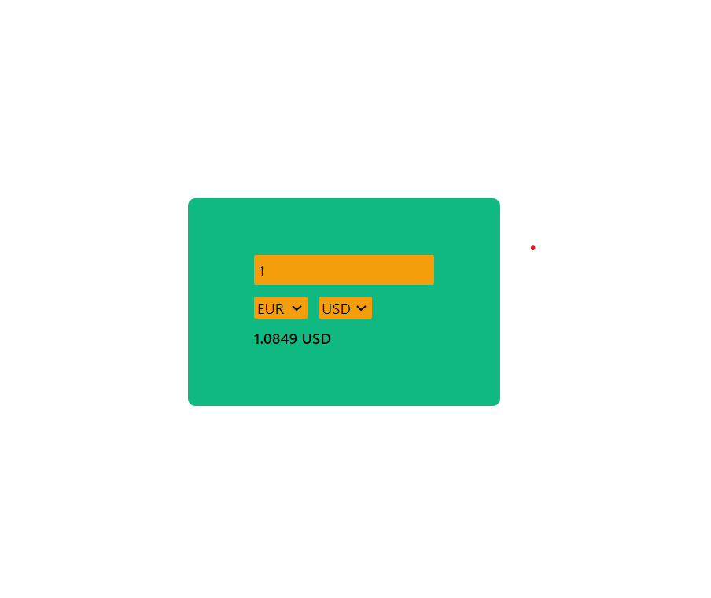

# Currency Converter App



A simple React app that allows users to convert currency between INR, CAD, USD, and EUR. Built with Tailwind CSS.

# Website is live on : <br>
https://cashflowconvert.netlify.app/
## Features

- Convert currency between INR, CAD, USD, and EUR.
- Responsive design using Tailwind CSS.
- User-friendly interface.

## Technologies Used

- React
- Tailwind CSS

## Getting Started

### Prerequisites

Make sure you have Node.js and npm installed on your machine.

### Installation

1. Clone the repository:

```bash
git clone https://github.com/Rupesh180902/currency-converter-app.git
```

2. Navigate to the project directory:

```bash
cd currency-converter-app
```

3. Install dependencies:

```bash
npm install
```

**Usage**

1. Start the development server:

```bash
npm start
```

2. Open your browser and visit http://localhost:3000.
3. Use the currency converter to convert between INR, CAD, USD, and EUR.

**Acknowledgments**

- Tailwind CSS: https://tailwindcss.com/
- React: https://reactjs.org/

**Author**
<br>
Rupesh Yadav
